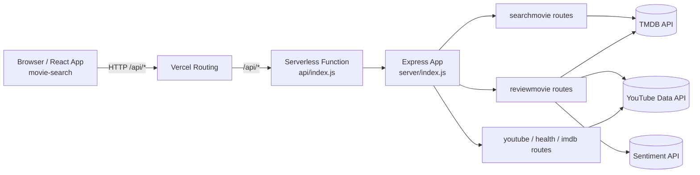
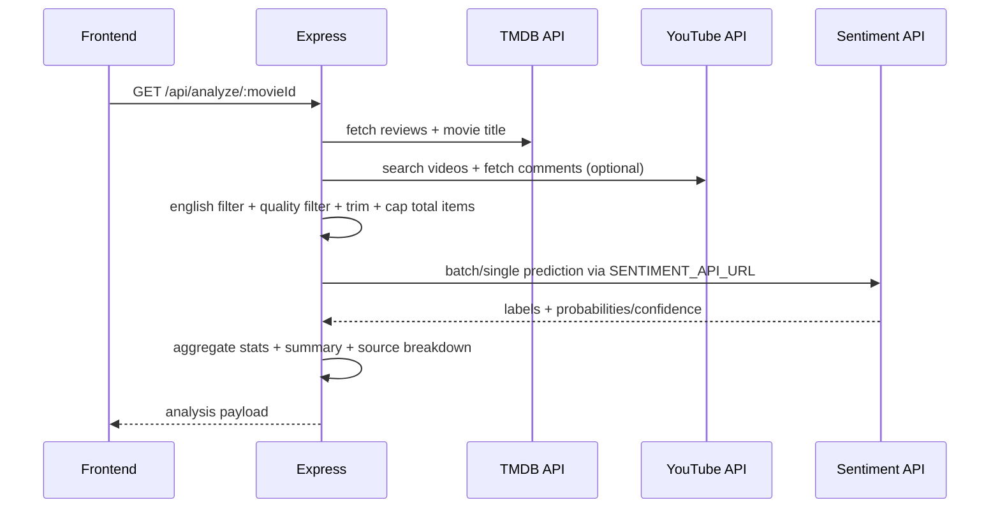

# System Architecture

เอกสารนี้อธิบายสถาปัตยกรรมเชิงระบบของโปรเจกต์ `movie_review`

## 1) High-Level Architecture

## 2) Runtime Components

### Frontend (React + Vite)
- Entry: `movie-search/src/main.jsx`
- Main UI orchestration: `movie-search/src/App.jsx`
- Core components:
  - `movie-search/src/components/Navbar.jsx`
  - `movie-search/src/components/MovieCard.jsx`
  - `movie-search/src/components/MovieDetailModal.jsx`

Responsibilities:
- movie discovery/search/filter UX
- movie detail modal
- model test UX
- client-side pagination and view switching (`home`, `model`)

### Backend (Express)
- Entry: `server/index.js`
- Mounted under `/api` (all routes)
- Vercel adapter: `api/index.js`

Responsibilities:
- proxy + aggregate data from TMDB/YouTube
- sentiment orchestration with external model API
- response normalization for frontend
- basic in-memory caching for analysis

## 3) API Layer (Current Contract)

Base path: `/api`

### Discovery/Search
- `GET /search`
- `GET /discover`
- `GET /genres`
- `GET /actors`

### Analysis & Model Test
- `GET /analyze/:movieId`
- `POST /sentiment/test`
- `GET /reviews/random`

## 4) Analysis Pipeline (`/api/analyze/:movieId`)

## 5) Caching Strategy

Location: `server/routes/reviewmovie.js`

- In-memory Map cache by `movieId`
- TTL: `ANALYSIS_TTL_MS` (default 30 min)
- Model metadata cache (`/health` from model service): `MODEL_META_TTL_MS`

Implication:
- fast repeated calls for same movie on same instance
- cache resets on redeploy/instance restart (non-persistent)

## 6) Configuration Surface

### Backend env
- `TMDB_API_KEY`
- `YOUTUBE_API_KEY`
- `SENTIMENT_API_URL`
- `ANALYSIS_MAX_ITEMS`
- `ANALYSIS_MAX_CHARS`
- `ANALYSIS_TTL_MS`
- `MODEL_META_TTL_MS`

### Frontend env
- `VITE_API_BASE`
  - local: `http://localhost:8080/api`
  - Vercel same-project deploy: `/api`

## 7) Deployment Architecture (Vercel)

`vercel.json` defines:
- static build output from `movie-search/dist`
- Node serverless for API (`api/index.js`)
- SPA fallback for non-API routes

Request routing:
1. `/api/*` -> serverless function -> Express route handlers
2. other paths -> static SPA (`index.html`) with client routing

## 8) Failure Modes & Behavior

- Missing `TMDB_API_KEY`: backend returns 500 for discovery/analysis routes
- YouTube quota exceeded / comments disabled:
  - analysis continues with TMDB-only when possible
- Sentiment API unavailable:
  - `/api/analyze/:movieId` returns 502 (`Sentiment service unavailable`)
  - `/api/sentiment/test` returns error response

## 9) Security & Ops Notes

- keep API keys only in env, never hardcode in repo
- rotate keys if exposed
- add rate limiting and request validation for production hardening
- external API quota monitoring is required (TMDB/YouTube/model service)

## 10) Scalability Considerations

Current design is optimized for simplicity and fast iteration.
For higher scale:
- replace in-memory cache with shared cache (Redis)
- queue/async aggregation for heavy analysis workloads
- precompute sentiment snapshots for popular movies
- add observability (structured logs + metrics + traces)
